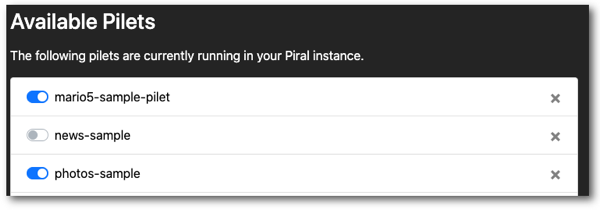
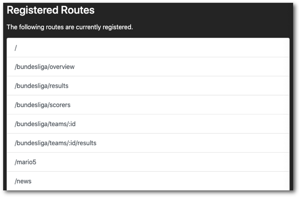
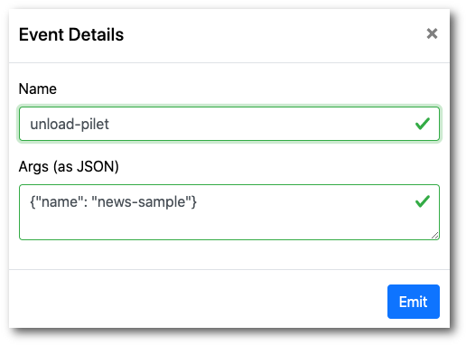

# Piral Browser Extension

## Introduction

To optimally work as a developer with your Piral Instance, and all of its containing pilets, Piral Inspector offers a great set of capabilities:

- Getting information about the currently running Piral Instance, e.g. name and version
- Overview on currently loaded pilets
- Adding / Removing of pilets on-the-fly
- Overview of registered routes
- Collection of emitted events
- Collection of global states

As a developer of your Piral Instance, or your pilets, you are used to working with a web browser. And this is precisely the best place to get assisted by the Piral Inspector during the development or testing phase.

We provide the Piral Inspector as an extension for the following browsers:

- [Google Chrome](https://chrome.google.com/webstore/detail/piral-inspector/ikbpelpjfgmplidagknaaegjhfigcbfl) (>= v50)
- [Firefox](https://addons.mozilla.org/en-US/firefox/addon/piral-inspector/) (>= v50)
- [Opera](https://addons.opera.com/en/extensions/details/piral-inspector/) (>= v50)

## Installation of Add-On / Extension

::: summary: Firefox

Type the following URL into the browser address line followed by hitting enter:

```plaintext
about:addons
```

On the following page, you can search for "Piral Inspector", and you will see the add-on as the first result:


Click on "Piral Inspector".

On the following details page, click on "Add to Firefox":


Now, a security message will appear, please click on "Add" to accept the required security settings:


Piral Inspector is now available, and you can open it via the Web Developer Tools (Tools > Web Developer > Toggle Tools).

On the tools bar, there now will also appear the Piral icon, and with a click on it, you will see the initial "Not connected" page.

In case you are currently running a Piral Instance in debug mode, you will see the available pilets and registered routes.


:::

::: summary: Google Chrome

Type the following URL into the browser address line followed by hitting enter:

```plaintext
https://chrome.google.com/webstore/category/extensions
```

On the following page, you can search for "Piral Inspector", and you will see the add-on as the first result.

Click on "Add to Chrome".


Now, a security message will appear, please click on "Add extension" to accept the required security settings:


Piral Inspector is now available, and you can open it via the Developer Tools (View > Developer > Developer Tools).

On the tools bar, there now will also appear the Piral icon, and with a click on it, you will see the initial "Not connected" page.

In case you are currently running a Piral Instance in debug mode, you will see the available pilets and registered routes.


:::

::: summary: Opera

Type the following URL into the browser address line followed by hitting enter:

```plaintext
addons.opera.com/extensions
```

On the following page, you can search for "Piral Inspector", and you will see the add-on as the first result.

Click on "Add to Opera".


Now, a security message will appear, please click on "Add extension" to accept the required security settings:


Piral Inspector is now available, and you can open it via the Developer Tools (Developer > Developer Tools).

On the tools bar, there now will also appear the Piral icon, and with a click on it, you will see the initial "Not connected" page.

In case you are currently running a Piral Instance in debug mode, you will see the available pilets and registered routes.


:::

## Using Piral Inspector

Piral Inspector offers a wide variety of capabilities regarding Piral Instance and its corresponding pilets.

The add-on/extension operates on a locally in debug mode running Piral Instance, and it directly interacts with it.

The following sections are shown inside the extension:

- Information about Piral Instance
- Available pilets
- Add pilets
- Registered Routes
- Events
- State Container

All of these sections will documented in the following chapters:

### Piral Instance

In the very left top, the extension shows the name and the version of the currently running Piral Instance.

Besides that, in the very right top, a click on the icon allows the user to adapt the extension's settings to its needs.


In the debug setting, the user can activate/deactivate the following options:


#### State Container Logging

Activates/Deactivates the logging of changes in the state container to the Developer Tools console.

#### Load Available Pilets

Activates/Deactivates the loading of the available pilets.

::: warning: Only for pilets
This feature has an impact only when the emulator is used, i.e., when `pilet debug` is running.
:::

#### Full Refresh on Change

Refreshes the current browser page in case there was a change in the debugged pilet.

::: warning: Only for pilets
This feature has an impact only when the emulator is used, i.e., when `pilet debug` is running.
:::

#### Visualize Component Origins

Activates the option to visualize the origin of the modules as another icon in Piral Instance section:


After clicking on the icon, the origin of each single tile will be displayed:


The origin will also be displayed when hovering over a tile.

### Available Pilets

The Piral Inspector lists all the currently available pilets. Like illustrated in the table below.



By clicking on the switch button on the left, the user can activate and deactivate each pilet.

With a click on the "X" on the right, the user can remove each pilet individually.

### Add Pilets

There are two options to load additional pilets into the currently running Piral Instance:

#### Add a Feed Address

Enter a feed address into the text field and click on the "Add" button.

In case you chose a feed you have access to, the corresponding pilets will be loaded and shown in the tile section and the list of available pilets. Per default, the new pilets will be active.

#### Bundle Local Pilet and Upload It

First, you need to "Browse" to the pilet package file and then "Upload" it.

In case you uploaded a proper pilet, it will be loaded and shown in the tile section and the list of available pilets. Per default, the new pilet will be active, but will be given a random name.

::: warning: Temporary Feed
The pilet will be loaded into a temporary feed, and this feed (including the pilets) will be removed when the predefined lifetime (by default 60 minutes) expires.
:::


### Registered Routes

This section shows all currently registered routes, and with a click on a single one, it will call the route.



In case the route needs one or more input parameters, a dialog will appear, and the user can provide the required information.


### Events

All events which occurred since the last refresh of the page are collected and shown in this section.


Besides that, the user can emit a new event:



### State Container

The final section shows the currently available global state (read-only):


