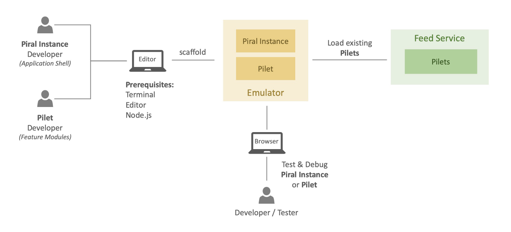

# Introduction

Many modern backend system landscapes follow the architecture pattern of **microservices**, while the frontends are still mostly implemented as single applications, which integrate with the entire backend as a kind of monolithic solution.

The **Piral** ecosystem offers the framework for building **micro frontend** solutions, which allows the creation of distributed web applications reflecting the flexibility and modularized structure of a microservice backend.

## Video

We also have a video tutorial:

@[youtube](https://youtu.be/ltTXWEwhSiY)

## Concepts

A **Piral instance** (application shell)

- brings the overall *design* of the application (e.g., header, footer, navigation, ...)
- includes *shared components* that can be used by pilets
- defines how pilets are loaded and *where pilets can integrate* their components

On the other side, the **pilets** (feature modules)

- brings the *content* for the application (e.g., functionality, queries and mutations, ...)
- include *their own* assets and dedicated dependencies
- define *where they want to integrate* their components into (as given by the Piral instance)

When the pilets have reached a certain maturity level, a developer can publish them into the **Pilet Feed Service**. Via the Feed Service available modules can be loaded into the local development environment so that developers and testers can validate how their new module integrates with other pilets.

## Setup Process

The following tutorials will start with guidance for the first steps through to advanced topics for working with the Piral framework.

{.auto}

The diagram above illustrates the setup and process for developing with Piral. The prerequisites are fairly minimal and as a developer you only need your favorite editor, a terminal, an Internet browser and Node.js installed. The **Piral instance** (application shell) and the **pilets** (feature modules) can be executed and debugged in the emulator on the local development machine.

::: tip: Piral without a feed service
Strictly speaking, a feed service is not necessary. You could use anything from a hardcoded list to a dynamically updated JSON file for getting to know where your pilets are.

Ultimately, you could even embed pilets directly, or reference them without going to a feed service at all. While we don't agree that this makes sense for most users, it could be a great way to get started.

Nevertheless, since we offer already a powerful [feed service](https://www.piral.cloud) that is free for usual development workloads you can make use of a dynamic pilet feed right away. If you need to run your own feed service then have a look at our [sample implementation using Node.js](https://github.com/smapiot/sample-pilet-service).
:::

Let's get started with the first tutorial and enter the world of Piral!
