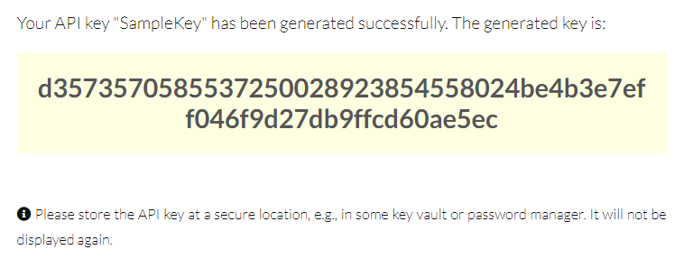

# Publishing Pilets

A working Piral system requires the following components:

1. A functional frontend (referred to as "application shell" or "Piral instance")
2. A backend / service delivering the pilets (referred to as "feed service")
3. A way to publish / integrate the created pilets, such that they can be delivered by the feed service

In terms of microfrontends, that's as minimal as it can be. Most solutions require special servers or modifications to infrastructure.

We designed Piral to be as simple as possible, while remaining as flexible and powerful as possible. The SPA-first approach removes any need for a server. With Piral you can go serverless if you want to.

## Piral Cloud Services

In this spirit we provide a free[^1] service that you can use for providing the feed service, as well as a way to publish your pilets. This leaves you at the task of creating a Piral instance.

**Remark:** The specification for a feed service is public. There should be everything you need if you already (or later) want to start building your own feed service. In addition to the publicly available specification we also have published a Node.js sample implementation at GitHub (https://github.com/smapiot/sample-pilet-service). The sample implementation can also be installed or run locally very easily.

The service can be found at https://feed.piral.io. Registration is possible by using a Microsoft Account to log into the service. We do not need any personal data besides the email / account id, which is provided after your approval.

Logging into the service you'll see the overview page. At this point nothing will be displayed as you have not created any feed yet.

[^1]: For development purposes and usage. The exact limitations are subject to change. Please see details on our feed service website.

## Creating a Feed

For publishing (or retrieving) pilets you will need a feed. A feed is like a container or folder. The link for creating the feed service can be found in the top menu.


To create the feed we need to give it a proper (unique) name. The system will check if the provided name is still available. The description can only be seen by you - it is optional. The allowed hosts you can also leave blank for now (resolving to `*`).

When you are done just press "create" and wait for the operation to complete. You will now be feed details page, which shows you the available pilets.

## Creating an API Key

On the feed details page we get all sorts of information. Most notably, we see the currently available pilets. However, before we can publish a pilet, we need to obtain an API key. For this we can go to the API keys of the current feed (either from the homepage listing all feeds, or on the details page by clicking the keys icon on the feed bar).

The API key management page lists all currently active API keys. It does not list the actual API keys. These are only visible when they are created.


By clicking the "generate API key" button we can provide all necessary information for generating a new API key.

Once a new key has been generated it will be shown for the first - and last - time. Make sure to copy it to a secure location. If you lose the key you should revoke it such that also no one else will be able to use it.



Armed with the key and the name of the generated feed we can now go on to publish our created pilet.

## Publishing a Pilet

Publishing a pilet works with the `piral-cli`. There is also a possibility for uploading a pilet package directly to the feed via the management website, however, for future purposes (e.g., for use in a CI/CD pipeline or anything else that is remotely automated) the `piral-cli` should be preferred. The Piral CLI would also work against other (or custom) feed services as long as they follow the specification remarked earlier.

Anyway, let's get going and publish the previously created sample pilet (named `my-pilet`) to a feed called `foo` (your feed will most likely have a different name, just copy the URL as shown on the feed website)!

```sh
pilet publish --fresh --url https://feed.piral.io/api/v1/pilet/foo --api-key d3573570585537250028923854558024be4b3e7eff046f9d27db9ffcd60ae5ec
```

The `--fresh` flag tells the Piral CLI to invoke a fresh build and do everything from building up to packaging the pilet. Without it we would already need a packaged pilet ready for publishing.

And that's it! Our pilet should now be live.
