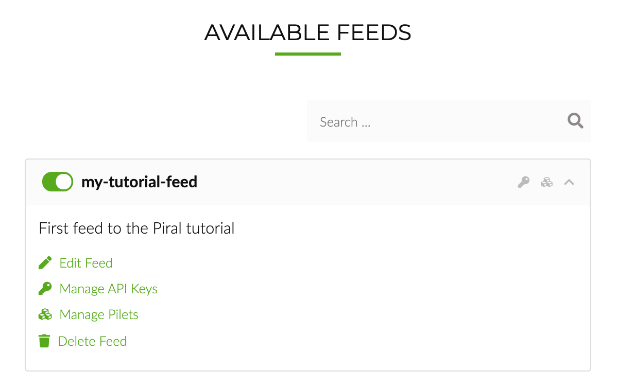
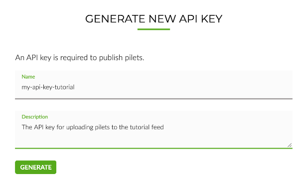
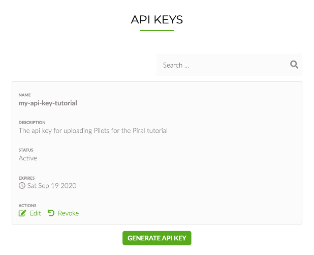

# Publishing Pilets

A working Piral system requires the following components:

1. A functional frontend (referred to as "application shell" or "Piral instance")
2. A backend/service delivering the pilets (referred to as "Feed Service")
3. A way to publish/integrate the created pilets, such that they can be delivered by the feed service

In terms of microfrontends, that's as minimal as it can be. Most solutions require special servers or modifications to infrastructure.

We designed Piral to be as simple as possible while remaining as flexible and powerful as possible. The SPA-first approach removes any need for a server. With Piral you can go serverless if you want to.

## Video

We also have a video tutorial:

@[youtube](https://youtu.be/2MlcqG-UCbA)

## Piral Cloud Services

In this spirit, we provide a free[^1] community edition of the service that you can use for providing the **feed service**, as well as a way to publish your pilets. This leaves you at the task of creating a Piral instance.

**Remark:** The specification for a feed service is public. There should be everything you need if you already (or later) want to start building your own feed service. In addition to the publicly available specification, we also have published a Node.js sample implementation at GitHub ([https://github.com/smapiot/sample-pilet-service](https://github.com/smapiot/sample-pilet-service)). The sample implementation can also be installed or run locally very easily.

The service can be found at [piral.cloud](https://www.piral.cloud). Registration is possible by using a Microsoft Account to log into the service. We do not need any personal data besides the email/account id, which is provided after your approval.

For our tutorials, we will utilize the community edition of the feed service.

[^1]: For development purposes and usage. The exact limitations are subject to change. Please see details on our feed service website.

## Overview

In the Getting Started tutorial, we covered already the creation of a Piral instance and its first pilet. This tutorial will guide us through the steps on how to publish our first pilet to the feed service and fetch it subsequently into the Piral instance.

This quick start will show us how to

1. Creating a **Feed** in the feed service
2. Create an **API Key** required for publishing the pilet
3. **Publish a pilet** to the feed service
4. **Configure the Piral Instance** to fetch pilets from the feed service

## Prerequisites

We assume that a Piral instance and a pilet is available as prerequisites for this tutorial. If not, please follow the getting started tutorial.

## Creating a Feed in the Piral Feed Service

For publishing (or retrieving) pilets you will need a feed. A feed is like a container or a folder, which contains a set of pilets. This section describes how to set up a feed for serving pilets.

### Access to the Feed Service

To use the community edition of the **feed service** as part of the Piral Cloud Services, you don't need to create or register an account. Just navigate to the community feed service [piral.cloud](https://www.piral.cloud) and sign in with a Microsoft Account by pressing the sign-in button on the home page of the service.


Upon successful login the landing page of the feed service will be displayed.

### Create a Feed

For creating a new feed, follow the link `Create Feed` on the right-hand side of the top menu.


To create the feed, we need to give it a proper (unique) name. The system will check if the provided name is still available. The description can only be seen by you - it is optional. The allowed hosts you can leave blank for now (resolving to `*`).

When you are done, just press `CREATE` and wait for the operation to complete. You will now see the feed details page, which shows you the available pilets.



In our case, we will see at least the feed, which we just have created.

## Obtain an API Key

Before we can publish our first pilet to our newly created feed, we need to obtain an API key.

### Create an API Key

To see al list of all available API keys, invoke the link `Manage API Keys` or press the "key" icon on the right-hand side of the feed bar of the current feed. As we did not create an API key, the list will be empty.

By clicking the `Generate API Key` button we can provide all necessary information for generating our first API key.



Upon pressing the `Generate` button, a new API key will be created.


Once the generation has completed, the generated key itself will be shown for the first - and last - time. Make sure to copy it to a secure location. If you lose the key, you should revoke it, such that also no one else will be able to use it.

::: warning: Keep your API key secure
The generated API key(s) should be treated as sensitive information. Anyone who is able to publish pilets potentially pushes code on your website, which is evaluated in the browsers of your users!

By default, the API keys expire after 1 year. We encourage you to periodically roll the keys to minimize the risk of leaked keys.
:::

Back on the API key management page, all currently available API keys will be listed. It shows the information about the API keys and it allows to edit or revoke the API key.



Armed with the key and the name of the generated feed we can now go on to publish our created pilet.

## Publishing a Pilet to the Feed Service

Publishing a pilet works with the `piral-cli`. There is also a possibility for uploading a pilet package directly to the feed via the management website, however, for future purposes (e.g., for use in a CI/CD pipeline or anything else that is remotely automated) the `piral-cli` should be preferred.

### Publish a Pilet

For this tutorial, we will use the pilet (named `my-pilet`), which we have created in the previous tutorial. We want to push the pilet to our feed `my-tutorial-feed` using the generated API key.

Since your feed will have a different name, just replace the name of the feed with your chosen name. When navigating to the "Manage Pilets" view for your feed, you will find the entire URL on the bottom of the page.

For publishing the pilet navigate to the folder of the pilet and invoke the following command:

```sh
pilet publish --fresh --url https://feed.piral.cloud/api/v1/pilet/my-tutorial-feed --api-key <your-api-key>
```

::: tip: Use the .piralrc file
If you don't want to provide the API key via the command line you could also create a *.piralrc* next to the *package.json* and place the `apiKey` in this file. Just make sure to **not** commit this file as it contains sensitive information.

You can find more information about the Piral CLI configuration [in one of the next chapters](https://docs.piral.io/guidelines/tutorials/08-the-piral-cli).
:::

The `--fresh` flag tells the Piral CLI to invoke a fresh build and do everything from building up to packaging the pilet. Without this flag, we would already need a packaged pilet ready for publishing.

::: warning: One publish per version
The official feed service only takes one pilet per name + version combination. This is considered a feature, as pilets are served by their name using a version. Therefore, if you want to update / republish the pilet, make sure to update the version first.

To update the version of a pilet either change the `version` key in its *package.json* or run `npm version` (e.g., `npm version patch`).
:::

### Check the Pilet Upload in the Feed Service

The feed service allows you to view and manage available pilets. To view all published pilets invoke the `Manage Pilets` link of the corresponding feed, in our case `my-tutorial-feed`.


The view shows further information about the published pilets and provides functions for managing the pilets.

## Configure the Feed Service in the Piral instance

Now that the pilet is available via the feed Service, we just need to configure our Piral instance to pull the pilets from the created feed. We need to modify the `index.tsx` file in the `./src` folder of the Piral instance. The path to the newly created feed needs to be specified, in our case:

```js
const feedUrl = 'https://feed.piral.cloud/api/v1/pilet/my-tutorial-feed';
```

Please assign your individual feed url accordingly. When you now launch your Piral instance using the piral-cli (`piral debug`), the newly published pilet will be loaded into the application shell.

## Next Steps

In this tutorial, you have

- Created a new **feed** using the community edition of the Piral feed service
- **Published a pilet** to the feed service
- Configured the application shell to **load pilets from a feed**

The next tutorial will describe the **Pilet API** in more detail.
