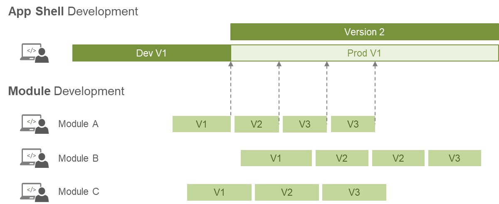

# Common Development Workflow

Piral was created by following a SPA-first, serverless-first, and developer-first philosophy. As such developer convenience was a very high priority for us.

A high developer convenience can be achieved by providing a seamless debugging experience together was an easy setup and pleasant tools. Ideally, all standard tools just work.

The essential development workflow is displayed below. We start with the app shell, which should be implemented up to a degree where some first pilets may be integrated. At some point, a "pilet factory" mode is started.

{.auto}

The important aspect of the diagram above is the deployment independence of each layer. Teams responsible for the different pilets can deploy independently of other teams. In reality, some feature constraints and other business values may impact the deployment independence, but technically there are no such constraints if well set up.

## Video

We also have this tutorial available in form of a video.

@[youtube](https://youtu.be/R-LqjbLuOqA)

## Setup Phase

In the setup phase, all the processes should be derived together with the team. While most of the team performs the onboarding to the desired tech stack (i.e., writing pilets, using React plus maybe others like GraphQL, Redux, Rx, ...) a smaller team takes care of creating an initial version of the app shell.

> Scaffold the Piral instance using the Piral CLI.

While creating the initial version of the app shell the corresponding pilet feed should be set up. While a custom feed service could be desirable in the long run our recommendation is to start at least with the [public feed service](https://feed.piral.cloud). Setting up a pilet feed and connecting the app shell to it can be done in no time.

> Create a pilet feed in the Piral feed service. Connect your app shell to it.

Once the initial version of the app shell has been created it can be published as a package to start the development of pilets. Additionally, the app should also be available in *some* environment (e.g., a development or staging environment).

> Publish the npm package of the app shell in a private npm registry.

Now the first pilets can be created. In the long run, it makes sense to also publish some of the initial features of the app shell as a pilet. For instance, if the app shell contains some kind of feedback functionality this could be also exposed as a pilet.

Our recommendation is to start with such functionality *within* the app shell and then outsource it once the platform stabilizes. Don't try to go too crazy with pilets first - the primary target of the setup phase should be a stable and reliable system that encourages developers to create great pilets.

> Publish the first pilets to the created pilet feed.

Having the first pilets successfully running within the Piral instance concludes the setup phase. At this point, the whole app could be also published in a production environment.

> Publish the app shell.

## Feature Phase

In the feature phase, we scale the application by gathering requirements, developing pilets, and publishing them. Of course, bug fixes and enhancements to existing pilets will be also covered in this phase.

> Build and publish more pilets.

Importantly, the role of feature flags (which are provided by the public feed service) becomes more dominant. Sometimes a new pilet should not be visible to everyone (or the full target audience for that matter), but just for some pilet customers or a certain region. Using the full dynamics of a data-driven approach that is independent of any development efforts or code becomes appealing.

> Adjust feature flags to bring personalized experiences to your users.

Also, the Piral instance will see changes in this phase. Pilets may require additional functionality in this phase, which could mean

- adding a new shared dependency,
- exposing a new API,
- changing how UX is done;

or the app shell becomes more lightweight by outsourcing parts of itself into pilets (as described in the setup phase). In any case, the whole UX is constantly improved.

> Split more functionality of the app shell into pilets.

The way how pilets are written also contains many different aspects. One possibility is that a pilet is written for a specific functionality and user group alone. Once another functionality with a potentially different access right is required another pilet must be written. Extensions allow hijacking the initial pilet with the elevated functionality.

> Determine when to split pilets and potentially split larger pilets or merge smaller ones.

## Maintenance Phase

Once the maintenance phase is reached only fixes to the pilets or the Piral instance should be published. Publishing any of these follows the same rules or processes in the feature phase.

> Publish hotfixes to pilets or the app shell.

A bug fix may be necessary due to a bug, legal requirements, or a security update to a third-party dependency. Shared dependencies require only a central update (with a subsequent deployment) of the Piral instance. Dependencies contained in pilets require an update of the particular pilets.

In the next part, we will look in more detail at the secret sauce for development - the Piral CLI.
